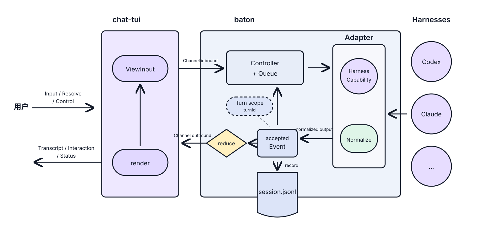

<p align="center">
  
</p>

<h1 align="center">baton</h1>

<p align="center"><strong>Pass context between coding agents like a baton.</strong></p>

<p align="center">
  <a href="README.md">English</a> |
  <a href="README.zh-CN.md">简体中文</a>
</p>

baton is a terminal-native workspace for coding agents, built around durable, harness-independent sessions and inspired by [tutti](https://github.com/tutti-os/tutti). Today, it lets you use Claude Code, Codex, and DeepSeek Harness in one TUI and switch between them without carrying context. Because BatonSession is owned by baton rather than any harness, the same foundation can grow from agent handoffs into multi-agent collaboration and orchestration. The bundled harnesses are not a closed support list.

Harness-native sessions are resume optimizations; BatonSession history remains available even when a native session cannot be resumed.

## Philosophy

The most common shape of multi-agent work today is a human acting as a context courier: copying one agent's output to another, re-explaining background, hand-writing handoff documents. baton wants context to be **an asset the user owns**, not a by-product locked inside a single tool.

Two fundamentals are in place today:

- **Context portability**: a BatonSession is a durable, unified history owned by the user that outlives any single harness. Switching agents requires no context carrying; harness-native sessions only accelerate resume and are never a prerequisite for the history to survive.
- **Native experience**: baton preserves each agent's own input, completion, streaming, tool-call, and approval experience as much as possible, adding only a few commands of its own (such as `/codex`, `/claude`, and `/dsh`).

The Plugin host adds a third principle:

- **Typed coordination**: baton core connects humans, Harnesses, and Baton Plugins through Core-owned Input, Interaction, HarnessInvocation, and Event lifecycles—not opaque messages. Harness-native verbs are lowered by Adapters; Plugin reconcile verbs are lowered by the host. Baton Plugins own long-running domain loops, while Harness Plugins such as devloop constrain the smaller development loop inside a Harness.

From a control-theory perspective, each long-running Plugin loop is a feedback controller: it first reads its Resource, then re-observes external facts through Connectors, acts through humans, Harnesses, or external systems, and finally updates status for the next reconcile. Completion means that observed domain facts have converged on the goal—not merely that an agent finished a turn.

On top of these, three product directions continue to evolve. A BatonSession already supports mainline and asynchronous side-lane tasks initiated by users or Plugins; coordinated fan-out and result curation remain incomplete:

- **Multi-harness collaboration**: a BatonSession can run multiple human- or Plugin-initiated lanes concurrently while keeping one durable ledger, and each lane can hand work between Harnesses serially. The next step is dispatching one task to several harnesses as a coordinated fan-out and curating results into the mainline.
- **Context intake**: the mainline is not a raw transcript of everything but the canonical history the user endorses. After a draft session produces results, the user decides whether to merge its conclusions into the mainline or discard them; discarding is not deletion — drafts stay durable and referenceable.
- **Event-driven long-running loops**: listen to external events such as pushed commits or merged PRs and wake the corresponding session to continue its work, so agents are no longer confined to an interactive terminal.

## Architecture at a glance

Start with the stable kernel: baton is one bidirectional pipeline. chat-tui carries `intent`/`render` only, the controller owns `Input`, Lane scheduling, and Turn lifecycle, adapters translate each harness's wire to a normalized event stream, and one `session.jsonl` persists events from every lane. The event stream is the sole source of truth; the UI is a projection.



v3 makes two boundaries explicit: Baton Core is the collaboration platform for humans, Harnesses, and Plugins; each business domain is delivered as one independently packaged Plugin with its own Resource, reconcile loop, completion criteria, and Connectors. Every Plugin-initiated Turn still follows the same Core-owned Input, Interaction, HarnessInvocation, Event, context, permission, and routing path.


The terminal has one focus and one host event loop; chat-tui isolates updates by surface, while Baton isolates third-party Package code in one Runner process per active Binding. A blocked or crashed Plugin therefore cannot occupy composer input, and its registrations are withdrawn as one unit.

See [`docs/kernel.md`](docs/kernel.md) for the stable core model, [`docs/workflow.md`](docs/workflow.md) for the end-to-end user/Harness flow, [`docs/harness.md`](docs/harness.md) for the adapter contract, and [`docs/plugin.md`](docs/plugin.md) for long-running domain loops and third-party authoring.

## Features

- Use Claude Code, Codex, and DeepSeek Harness from the same terminal interface
- Let Plugins ask users, prepare editable drafts, or run Harness Turns on the main/new Lane through `ReconcileContext`
- Paste a clipboard image with `Ctrl+V` and send it as native image input to Codex or Claude Code
- Switch directly with `/codex`, `/claude`, or `/dsh`; supported runtime configuration remains Harness-specific
- Use one Plan mode across Codex and Claude Code, with `/plan` or `Shift+Tab` to toggle back to Default
- Open a previous BatonSession with `/sessions`, or start a clean one with `/new`
- Generate a compact session title after the first turn, with cross-harness fallback and no native session side effects
- Continue the latest session in a project with `baton -c`, or open one by ID with `baton -s <id>`
- Resume or fork an existing Codex/Claude Code native session by ID, with read-only auto-detection
- Search grouped `@` context from built-in Session and Plugin Mentions, then inject it into the current turn
- Record messages, thoughts, tool calls, file changes, plans, and token usage in a unified format
- Preserve harness startup interactions such as Codex hook trust, reusing unchanged trusted definitions with a visible notice
- Append events to a local `session.jsonl` for state reconstruction and future references
- Reuse local Harness credentials and runtime configuration without storing provider secrets in baton
- Use a headless REPL to debug agent integrations
- Register local or Git Plugin Marketplaces and install immutable Plugin Packages
- Run each active third-party Plugin Binding in its own supervised process
- Run session-scoped Plugin Controllers over durable Resources, with Resource/cron Sources, requeue wakeups, Board projections, and reconcile-scoped user interactions

## Installation & configuration

Install baton with npm. You also need at least one supported runtime: an authenticated [Codex CLI](https://github.com/openai/codex), [Claude Code](https://docs.anthropic.com/en/docs/claude-code/overview), or a DeepSeek Harness JSON-RPC runtime configured for the DSH Agent SDK.

```bash
npm install -g @compforge/baton
```

Or run it once without a global install:

```bash
npx @compforge/baton
```

On first run, baton creates `~/.baton/config.yaml`:

```yaml
defaultTarget: codex
targets:
  codex:
    harness: codex
    command: [codex, app-server]
  claude:
    harness: claude
  dsh:
    harness: dsh
    # command: [dsh-jsonrpc-agent, /absolute/path/to/cordis.yml]
    model: prod
mentionBudgetChars: 4096
showThoughts: true
```

See [`config.yaml.example`](config.yaml.example) for all available options and usage notes.

Codex approvals follow Codex's own configuration by default — your `~/.codex/config.toml`, profiles and any enterprise policy all apply, and Codex itself defaults to reviewing with you. Set `targets.codex.approvalReviewer: auto_review` to delegate to its risk reviewer instead; Baton keeps that delegation visible in Harness Status and records each automatic decision beside its target tool.

If Claude Code uses a custom executable, set `targets.claude.executable` or override it temporarily with an environment variable (`BATON_CLAUDE_BIN=/path/to/claude baton`). Configuration precedence: environment variables > Target configuration > Harness defaults.

DeepSeek Harness uses `@compforge/dsh-agent-sdk`. Set `targets.dsh.command` to the complete JSON-RPC runtime argv, including the Cordis config path. Baton defaults DSH to model `prod`; the Target's `provider` can select another provider route, while the runtime/provider owns the output-token limit. Provider credentials remain in DSH's own credential store. See [the DSH adapter guide](docs/harness/deepseek-harness.md) for its current capability and cancellation boundaries.

## Usage

Start the TUI and type a prompt to send it.

```text
/claude or /cc       Switch to Claude Code
/codex or /cx        Switch to Codex
/dsh or /deepseek    Switch to DeepSeek Harness
/target              Open the configured HarnessTarget picker
/target <id>         Switch to a configured HarnessTarget
/cc <message>        Switch to Claude Code and send the message immediately
/cx <message>        Switch to Codex and send the message immediately
/deepseek <message>  Switch to DeepSeek Harness and send the message immediately
/cla <message>       Unique harness-name prefixes work too
/model               Open the model picker for the active harness
/model <id>          Select the model used by subsequent turns
/effort              Open the reasoning-effort picker for the active harness
/effort <level>      Select the reasoning effort used by subsequent turns
/plan                Switch the active harness to Plan mode
/compact             Ask the active harness to compact its context
/status              Show the active harness/model context usage and session information
/sessions            Open the BatonSession picker
/new                 Start a new BatonSession in the current project
@                      Search grouped Session and Plugin context
Tab                   Complete a command or reference
Shift+Tab             Toggle the active harness between Default and Plan mode
Ctrl+V                Paste text or a clipboard image into the composer
Esc                   Interrupt the current turn
/exit                 Exit
```

Ambiguous prefixes such as `/c <message>` are not sent to a harness; baton reports the matching harnesses in the transcript.

Common CLI commands:

```bash
baton                              # Start the TUI
baton --cwd /path/to/project       # Start in a specific project directory
baton -c                           # Continue the latest session in this directory
baton -s bs_01...                  # Open a specific BatonSession
baton resume [bs_xxx|native-id]    # Resume; native IDs are imported first
baton fork [bs_xxx|native-id]      # Import if needed, then fork the BatonSession
baton repl --agent codex           # Start the headless REPL with Codex (alias: cx)
baton repl --agent claude          # Start the headless REPL with Claude (alias: cc)
baton sessions                     # List sessions available for reference
baton logs [session-id]             # Inspect structured Baton/Harness/Plugin logs
baton plugins marketplace add ./reqloop
baton plugins marketplace remove reqloop
baton plugins available
baton plugins install qiankun/requirement-loop
baton plugins list
baton help                         # Show full help
```

For HarnessSession IDs, baton probes Codex and Claude Code read-only. A unique match is selected
automatically; if both Harnesses contain the same ID, use `cx:<id>` or `cc:<id>` (or choose
interactively). Baton first adopts or reuses a source BatonSession, reconstructing the
durable history observed by the Inspector as ordinary turns attributed to that Harness, as if the BatonSession had
existed from the start. Both bundled Harnesses import their durable full history: Codex includes
reasoning, tools, and plan proposals; Claude Code includes thinking, tool calls/results, and plan
state. `resume` opens that source; `fork` applies the ordinary BatonSession fork to it, so the child
starts with a fresh HarnessSession in the command's current project. The adopted source remains
bound to the original HarnessSession. Baton does not mirror other clients in the background;
explicitly using the ID again verifies the full semantic prefix with HarnessHistoryBoundary and appends a new tail
to the existing Baton owner before resume/fork.

Reference an ID returned by `baton sessions` in your prompt:

```text
@bs_01... Implement this feature based on Claude's earlier analysis
```

baton reads the referenced session's compact summary and passes it to the active harness as context.

## Data storage

baton stores its data in `~/.baton/` by default:

```text
~/.baton/
├── config.yaml
├── attachments/                              # Content-addressed pasted images
├── plugins/
│   ├── marketplaces.json
│   ├── marketplaces/<marketplace-name>/
│   ├── packages/<encoded-plugin-id>/<version>/
│   └── <encoded-plugin-id>/                 # Plugin global writable data
└── projects/<project-key>/
    ├── project.json
    ├── plugins/<encoded-plugin-id>/         # Plugin project/workspace data
    └── sessions/<session-id>/
        ├── meta.json
        ├── session.jsonl
        ├── session.log
        └── plugins/
            ├── <encoded-plugin-id>/         # Plugin session data
            └── <plugin-instance-id>/
                └── resources/
```

Projects group sessions by working directory using a readable, collision-resistant key; `project.json` retains the original `cwd`. Pasted images are immutable, content-addressed attachments shared by session histories and forks, while `session.jsonl` keeps only their paths. Plugins receive writable global, Project/workspace, Session, and Instance scope roots and decide their internal layout, while Resource, Interaction, and HarnessInvocation facts remain behind the host APIs. `session.jsonl` is the durable logical history used for rendering, recovery, harness handoff, and cross-session references. `session.log` is a private, rotated operational log shared by Baton components, Harness adapters, and Plugins; use `baton logs` to filter it by level, component, or Plugin. Each Harness still manages its private native sessions; baton stores only the binding needed to accelerate resume and never modifies native session files.

## License

Apache-2.0
