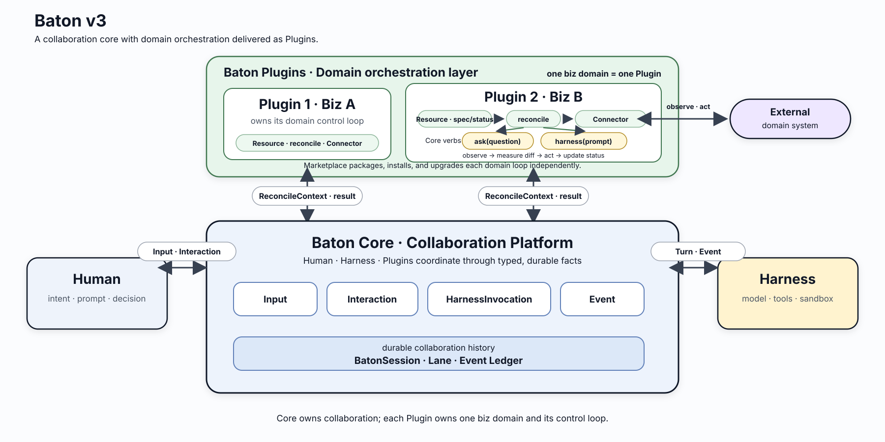

<p align="center">
  
</p>

<h1 align="center">baton</h1>

<p align="center"><strong>Pass context between coding agents like a baton.</strong></p>

<p align="center">
  <a href="README.md">English</a> |
  <a href="README.zh-CN.md">简体中文</a>
</p>

baton is a terminal-native workspace that lets Claude Code, Codex, and DeepSeek Harness share one durable conversation. Switch agents without copying context, reopen the work later, or let Plugins keep it moving after an interactive turn ends.

A BatonSession belongs to you rather than to any Harness. Native sessions make resume faster, but baton keeps the logical history available even when a native session cannot be resumed. The bundled Harnesses are only the starting set.

## Why baton

Most multi-agent workflows turn the human into a context courier: copy an answer, explain the task again, and hope the next agent sees the same picture. baton replaces that relay race with a workspace where context is durable, agents stay native, and longer-running work can continue through explicit human and Plugin coordination.



## Features

- Work with Claude Code, Codex, and DeepSeek Harness in one terminal-native interface, switching targets, models, and modes while preserving each Harness's native experience.
- Own durable BatonSessions that unify history across Harnesses, reopen or fork work, adopt native sessions, and bring Session or Plugin context into later turns.
- Turn one chat into a long-running workflow: Plugins can ask for decisions, prepare editable drafts, wake on schedules or events, and delegate work to the mainline or asynchronous side lanes.
- Install third-party Plugins from local or Git Marketplaces without handing baton your provider credentials; each Plugin runs in its own supervised process.

## Install

Install baton with npm. You also need at least one supported runtime: an authenticated [Codex CLI](https://github.com/openai/codex), [Claude Code](https://docs.anthropic.com/en/docs/claude-code/overview), or a DeepSeek Harness JSON-RPC runtime configured for the DSH Agent SDK.

```bash
npm install -g @compforge/baton
```

Or try it without a global install:

```bash
npx @compforge/baton
```

## Quick start

Start the TUI in your project and type a prompt:

```bash
baton
```

The essential commands are:

```text
/claude or /cc       Switch to Claude Code
/codex or /cx        Switch to Codex
/dsh or /deepseek    Switch to DeepSeek Harness
/target              Pick a configured Harness target
/model               Pick a model for the active Harness
/effort              Set reasoning effort
/plan                 Toggle Plan mode
/queue                Manage queued follow-ups (recall, delete, reorder, or dispatch now)
/thoughts             Toggle agent thought display for this session
/sessions             Open a previous BatonSession
/new                  Start a clean BatonSession
@                     Search Session and Plugin context
Ctrl+V                Paste text or a clipboard image
Esc                   Interrupt the current turn
```

Add a message to a switch command to route it immediately, for example `/cx review this diff` or `/cc implement the fix`.

## Carry work between sessions

```bash
baton -c                           # Continue the latest session in this project
baton -s bs_01...                  # Open a BatonSession by ID
baton resume [bs_xxx|native-id]    # Resume a Baton or native Harness session
baton fork [bs_xxx|native-id]      # Fork into a new BatonSession
baton sessions                     # List referenceable sessions
```

baton can detect Codex and Claude Code session IDs without modifying their files. It imports their durable history into a user-owned BatonSession; `resume` continues the source, while `fork` starts a new branch of work. Reference any listed session in a later prompt:

```text
@bs_01... Implement this feature based on Claude's earlier analysis
```

## Add long-running workflows

Plugins can ask for a decision, prepare a draft for editing, delegate a turn to a Harness, update a shared Board, or wake again from Resource changes and schedules. Install them from a local or Git Marketplace:

```bash
baton plugins marketplace add ./reqloop
baton plugins available
baton plugins install qiankun/requirement-loop
baton plugins list
```

Each active third-party Plugin runs in its own supervised process. A blocked or crashed Plugin does not take over the terminal, and provider credentials remain in the Harness that owns them.

## Configuration

On first run, baton creates `~/.baton/config.yaml`:

```yaml
defaultTarget: codex
targets:
  codex:
    harness: codex
    command: [codex, app-server]
  codex2:
    harness: codex
    command: [codex, app-server]
    env:
      CODEX_HOME: /Users/you/.codex2
  claude:
    harness: claude
  dsh:
    harness: dsh
    # command: [dsh-jsonrpc-agent, /absolute/path/to/cordis.yml]
    model: prod
mentionBudgetChars: 4096
showThoughts: true
notifications: true
```

`notifications` controls desktop notifications (OSC 9) when a turn finishes or an approval/question needs you. It is on by default and stays silent on terminals outside the known-support list (iTerm2, WezTerm, Kitty, Ghostty, Warp). Inside tmux 3.3+, DCS passthrough also requires `set -g allow-passthrough on` in `~/.tmux.conf`. Use `notifications: { enabled: true, bell: true }` to fall back to the terminal bell elsewhere.

See [`config.yaml.example`](config.yaml.example) for all options. Multiple Targets may use the same Harness; a Target-level `env` can select a provider-owned account directory such as `CODEX_HOME` or `CLAUDE_CONFIG_DIR`. Use absolute paths and keep tokens out of this file. baton reuses each Harness's existing credentials and runtime configuration instead of copying provider secrets. Codex approvals continue to follow the selected Codex home unless the Target's `approvalReviewer` delegates them; Claude Code can use `targets.claude.executable`; DeepSeek Harness uses the command configured in `targets.dsh.command`.

## Your data stays local

baton stores its configuration, attachments, Plugins, projects, and durable session history under `~/.baton/`. Each Harness continues to own its private native sessions; baton never edits those files and stores only the binding needed to resume them. Use `baton logs [session-id]` to inspect the private, rotated operational log for a session.

## License

Apache-2.0
