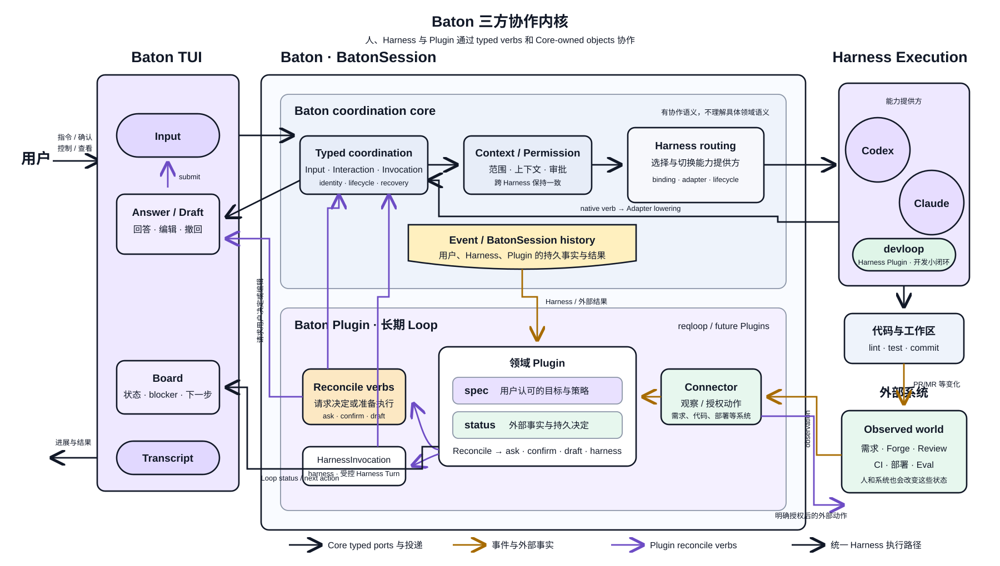

<p align="center">
  
</p>

<h1 align="center">baton</h1>

<p align="center"><strong>像传递接力棒一样，在 coding agents 之间传递上下文。</strong></p>

<p align="center">
  <a href="README.md">English</a> |
  <a href="README.zh-CN.md">简体中文</a>
</p>

baton 是一个以持久、harness-independent 会话为内核的 terminal-native coding-agent workspace，受 [tutti](https://github.com/tutti-os/tutti) 启发。当前，你可以在同一个 TUI 中使用 Claude Code 和 Codex，并在切换 agent 时自然延续上下文。由于 BatonSession 由 baton 而不是任何 harness 持有，这套基础能力可以从 agent 接力进一步演进到多 agent 协作与编排。Claude Code 和 Codex 是首批内置 harness，不是封闭支持列表。

各家的原生会话只是恢复加速；即使原生会话无法恢复，BatonSession 历史仍然存在。

## 理念

多 agent 协作最常见的形态，是人变成 agent 之间的传话筒：把一个 agent 的产出复制给另一个、反复解释背景、手写文档接力。baton 想把上下文变成**用户拥有的资产**，而不是锁在某个工具里的副产品。

当前已落地的两个基本点：

- **上下文打通**：BatonSession 是用户拥有的持久统一历史，跨 harness 存续。换 agent 不需要搬运上下文；各家原生会话只承担恢复加速，不是历史存续的前提。
- **原生体验**：尽量保留单独使用各 agent 时的输入、补全、流式输出、工具调用与审批体验，baton 只增加少量自己的命令（如 `/codex` 和 `/claude`）。

Plugin host 又增加了一条原则：

- **Loop 分层**：baton core 保持领域无关，统一拥有 Input、Context、Permission 与 Harness routing 路径。Baton Plugin 拥有长期领域 loop，当前默认建议下一条 Harness 输入，交给用户确认、编辑或丢弃；Harness 仍是智能执行能力提供方，devloop 等 Harness Plugin 只约束 Harness 内部的开发小闭环。

在此之上仍有三个产品演进方向。Plugin host 已经提供长期 loop 所需的 Resource / Controller 基础，但这些端到端体验尚未完整落地：

- **多 harness 协作**：从同一会话内接力，走向把同一任务并行分派给多个 harness，结果汇回同一份统一历史。近路径是草稿会话——任务进行中有新想法时，拉一个草稿会话（可换 harness）并行探索，主线不被打断。
- **上下文收录**：主线不是全量流水账，而是用户认可的正典历史。草稿会话出了成果后，由用户决定将结论合入主线还是丢弃；丢弃不等于删除，草稿仍持久、可再引用。
- **事件驱动的长期 loop**：监听代码提交、PR 合并等外部事件，重新唤醒对应会话继续后续工作，让 agent 不止活在交互式终端里。

## 架构速览

先从稳定内核理解 baton：它是一条双向流水线。chat-tui 只承载 `intent`/`render`，controller 拥有 `Input` 生命周期与 driven-turn 队列，adapter 把各 harness 的 wire 归一成同一条事件流，`session.jsonl` 落盘持久化。事件流是唯一真相源，UI 是它的投影。


v2 保留这条流水线，并在其外分层组织长期领域 loop：baton core 保持领域无关并统一控制，Baton Plugin reconcile 领域 Resource 并提出工作建议，Harness 提供智能执行能力，Harness Plugin 约束 Harness 内部的小闭环。当前建议的工作会回到同一条 Input、Context、Permission 与 routing 路径，交给用户确认、编辑或丢弃。



终端只有一个焦点和一个宿主事件循环；chat-tui 按 surface 隔离订阅与重绘，Baton 则让每个活动的三方 Plugin Binding 进入独立 Runner 进程。某个 Plugin 阻塞或崩溃不会占住 composer，它的注册会作为一个整体撤销。

稳定内核见 [`docs/kernel.md`](docs/kernel.md)，用户与 Harness 的端到端流程见 [`docs/workflow.md`](docs/workflow.md)，Harness 适配契约见 [`docs/harness.md`](docs/harness.md)，长期领域 loop 与三方 Plugin 开发见 [`docs/plugin.md`](docs/plugin.md)。

## 功能

- 在同一个终端界面中使用 Claude Code 和 Codex
- 使用 `Ctrl+V` 粘贴剪贴板图片，并作为原生图片输入发送给 Codex 或 Claude Code
- 使用 `/codex` 或 `/claude` 直接切换 agent，并分别配置当前 harness 的模型与推理强度
- 使用 `/sessions` 打开历史 BatonSession，或用 `/new` 新建干净会话
- 首个 turn 后自动生成简洁会话标题，支持跨 harness 降级且不会创建原生会话
- 使用 `baton -c` 继续当前项目最近会话，或用 `baton -s <id>` 打开指定会话
- 按 ID resume 或 fork 已有 Codex / Claude Code 原生会话，并以只读方式自动识别来源
- 使用分组可搜索的 `@` 上下文，引用内置 Session 或 Plugin 提供的对象并注入当前 turn
- 统一记录消息、思考、工具调用、文件改动、计划和 token usage
- 保留 Codex hook trust 等 harness 启动交互；已信任且未变化的定义会自动复用并明确留痕
- 将事件追加写入本地 `session.jsonl`，支持状态重建和后续引用
- 复用本机 Claude Code / Codex 登录态，不托管凭证
- 提供 headless REPL，方便调试 agent 接入链路
- 注册本地或 Git Plugin Marketplace，并安装不可变的 PluginPackage
- 让每个活动的三方 Plugin Binding 在独立、受监管的进程中执行
- 让 session-scoped Plugin Controller reconcile 持久 Resource，支持 Resource/cron Source、requeue 唤醒、Board 投影与用户确认 Proposal

## 安装与配置

使用 npm 安装 baton。此外需要安装并登录至少一个受支持的 agent（[Codex CLI](https://github.com/openai/codex) / [Claude Code](https://docs.anthropic.com/en/docs/claude-code/overview)）。

```bash
npm install -g @compforge/baton
```

也可以不做全局安装，直接运行一次：

```bash
npx @compforge/baton
```

首次运行会生成 `~/.baton/config.yaml`：

```yaml
defaultAgent: codex
codexCommand:
  - codex
  - app-server
mentionBudgetChars: 4096
showThoughts: true
```

所有配置项及说明见 [`config.yaml.example`](config.yaml.example)。

Codex 审批默认跟随 Codex 自己的配置（`~/.codex/config.toml`、profile、企业策略照常生效，Codex 自身默认人工审批）。设置 `codexApprovalReviewer: auto_review` 才把审批委托给自动 reviewer——委托状态会常驻 Harness Status，每条自动决策也在对应工具旁留下回执。

如果 Claude Code 使用自定义可执行文件，可以在配置中设置 `claudeExecutable`，或通过环境变量临时覆盖（`BATON_CLAUDE_BIN=/path/to/claude baton`）。配置优先级为：环境变量 > `config.yaml` > 默认值。

## 使用

启动 TUI 后直接输入内容即可发送。

```text
/claude 或 /cc        切换到 Claude Code
/codex 或 /cx         切换到 Codex
/cc <消息>           切换到 Claude Code 并立即发送消息
/cx <消息>           切换到 Codex 并立即发送消息
/cla <消息>          harness 名的唯一前缀也可使用
/model               打开当前 harness 的模型选择器
/model <id>          设置后续 turn 使用的模型
/effort              打开当前 harness 的推理强度选择器
/effort <level>      设置后续 turn 使用的推理强度
/plan                将当前 harness 切换到 Plan 模式
/compact             请求当前 harness 压缩上下文
/status              查看当前 harness/model 的上下文用量和会话信息
/sessions            打开 BatonSession 选择器
/new                 在当前项目新建 BatonSession
@                      分组搜索 Session 和 Plugin 上下文
Tab                   补全命令或引用
Shift+Tab             在 Default 与 Plan 模式间切换
Ctrl+V                向输入框粘贴文本或剪贴板图片
Esc                   中断当前 turn
/exit                 退出
```

`/c <消息>` 这类歧义前缀不会发送给 harness；baton 会在 transcript 中列出匹配到的 harness。

常用 CLI 命令：

```bash
baton                              # 启动 TUI
baton --cwd /path/to/project       # 在指定项目目录启动
baton -c                           # 继续当前目录最近的 BatonSession
baton -s bs_01...                  # 打开指定 BatonSession
baton resume [bs_xxx|native-id]    # resume；原生 ID 会先导入
baton fork [bs_xxx|native-id]      # 必要时先导入，再 fork BatonSession
baton repl --agent codex           # 使用 Codex 的 headless REPL（别名：cx）
baton repl --agent claude          # 使用 Claude 的 headless REPL（别名：cc）
baton sessions                     # 查看可引用的历史会话
baton logs [session-id]             # 查看 Baton/Harness/Plugin 结构化日志
baton plugins marketplace add ./reqloop
baton plugins marketplace remove reqloop
baton plugins available
baton plugins install qiankun/requirement-loop
baton plugins list
baton help                         # 查看完整帮助
```

对裸 HarnessSession ID，baton 会只读探测 Codex 与 Claude Code：只有一方命中时自动选择；两边都命中时
可交互选择，或用 `cx:<id>` / `cc:<id>` 显式消歧。baton 会先 adoption 或复用一个源 BatonSession，
把 Inspector 可只读恢复的持久历史还原成归属于该 Harness 的普通 Baton turn，等价于这个
BatonSession 从一开始就存在。两个内置 Harness 都会导入各自可持久恢复的完整历史：Codex
包含 reasoning、工具和计划提案，Claude Code 包含 thinking、工具调用/结果和计划状态。
`resume` 直接打开这个源；`fork` 对它执行普通 BatonSession fork，因此 child 会在命令当前
project 中启动全新的 HarnessSession。adoption 源继续绑定原 HarnessSession。Baton 不会在后台自动镜像
其它客户端的写入；再次显式使用该 ID 时，会用 HarnessHistoryBoundary 校验完整语义前缀并把新增尾部补入已有
Baton owner，再 resume / fork。

在输入中引用 `baton sessions` 列出的 ID：

```text
@bs_01... 根据前面 Claude 的分析实现这个功能
```

baton 会读取被引用会话的紧凑摘要，并将其作为上下文交给当前 harness。

## 数据存储

baton 的数据默认保存在 `~/.baton/`：

```text
~/.baton/
├── config.yaml
├── attachments/                              # 按内容寻址的剪贴板图片
├── plugins/
│   ├── marketplaces.json
│   ├── marketplaces/<marketplace-name>/
│   └── packages/<encoded-plugin-id>/<version>/
└── projects/<project-key>/
    ├── project.json
    └── sessions/<session-id>/
        ├── meta.json
        ├── session.jsonl
        ├── session.log
        └── plugins/<plugin-instance-id>/
            ├── resources/
            └── proposals/
```

Project 使用可读且防碰撞的 key 按工作目录组织会话，原始 `cwd` 记录在 `project.json` 中；剪贴板图片作为不可变、按内容寻址的附件由会话历史与 fork 共享，`session.jsonl` 只保存其路径。Plugin 运行数据归属对应 BatonSession。`session.jsonl` 是用于渲染、恢复、harness 接力和跨会话引用的持久逻辑历史。`session.log` 是 Baton 内部组件、Harness adapter 与 Plugin 共用的私有轮转运维日志，可用 `baton logs` 按级别、组件或 Plugin 过滤。各 agent 的原生会话仍由 Claude Code / Codex 管理；baton 只保存其 ID 用于加速 resume，不会修改原生 session 文件。

## License

Apache-2.0
